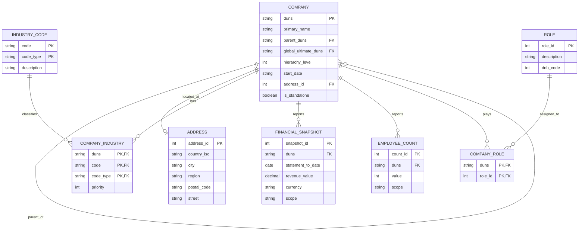

# Data Engineering Technical Task

A small Python pipeline that ingests two D&B JSON sources per company (`family_tree.json` and `data_blocks.json`), enriches each family tree member with parent linkage and global metrics from the data blocks, and writes the combined output to a single Parquet file.

## Project structure

```
.
├── src/
│   ├── models.py        # Pydantic models -- only the fields critical to validate
│   ├── ingestion.py     # JSON loading + validation gate
│   ├── transform.py     # join/enrichment logic + data quality checks
│   └── pipeline.py      # entry point, orchestrates the run
├── tests/
│   └── test_transform.py
├── TechTaskDEI_II (2026)/
│   ├── companyA/
│   ├── companyB/
│   └── companyC/
├── output/
│   └── enriched_companies.parquet  # generated
├── requirements.txt
└── README.md
```

The split between `ingestion`, `transform` and `pipeline` follows single responsibility: if the input format ever changes (API instead of files, different JSON shape), only `ingestion.py` needs to change.

## How to run

```bash
pip install -r requirements.txt
python -m src.pipeline
pytest tests/
```

The pipeline reads from `TechTaskDEI_II (2026)/`, processes the three companies, and writes a combined Parquet to `output/enriched_companies.parquet`.

## Data modelling

I designed a normalised relational schema (3NF) with `company` as the central entity and a self-referencing FK for the parent-subsidiary hierarchy. The diagram below shows the proposed schema.



### Key decisions

- **DUNS as primary key.** It's a globally unique, immutable, 9-digit identifier issued by D&B. Using it as the PK avoids surrogate keys and makes joins with external D&B data trivial.
- **Self-referencing FK for hierarchy.** `parent_duns` points back to `company.duns`. This is the standard adjacency-list pattern for hierarchies in relational databases. Recursive CTEs handle traversal cleanly.
- **`scope` column on financial/employee tables.** D&B reports both *individual* (legal entity only) and *consolidated* (group-wide) figures. Instead of separate columns per scope, a `scope` discriminator keeps the schema flexible if a third scope appears.
- **Composite key on `INDUSTRY_CODE`.** Codes come from multiple classification systems (NAICS, SIC, NACE). The same number means different things in different systems, so the key is `(code, code_type)`.
- **`ROLE` as lookup table.** The set of corporate roles ("Global Ultimate", "Subsidiary", etc.) is finite and reused, so it's a lookup table rather than a free-text column.

## Pipeline design

The flow per company:

1. `load_family_tree()` reads `family_tree.json` and validates each member with Pydantic. Records missing required fields (`duns`, `primaryName`) are logged and skipped -- the rest of the run continues.
2. `load_data_blocks()` reads `data_blocks.json`. If validation fails, it returns `None`; the pipeline still processes the family tree without the global enrichment.
3. `enrich_family_tree_with_parent()` flattens each member into a row with parent linkage (`parent_duns`), hierarchy level, role descriptions, and the globals (revenue, employees) from the data blocks.
4. `run_data_checks()` validates the result before writing: no empty output, no null DUNS, no duplicate DUNS, hierarchy levels >= 1. Fill rates for optional columns are logged for observability.
5. The DataFrames for all companies are concatenated and written to a single Parquet file (PyArrow engine).

### Key decisions

- **Pydantic validates only critical fields.** D&B has many optional nested fields (addresses, financials, employees) that are legitimately null for some companies. Validating them all would create false negatives. I validate only `duns` and `primaryName` (the business keys) and access the rest defensively in the transform with `.get() or {}`.
- **Validation gate, not type carrier.** `ingestion.py` validates the records but returns plain dicts to the rest of the pipeline. Carrying Pydantic objects through the transform would force me to define every nested field. Dict + defensive access is simpler for this single-use processing.
- **Log-and-continue on errors.** A malformed record gets logged at `ERROR` level and skipped. Aborting the whole run because of one bad record would be the wrong trade-off for a data pipeline.
- **`raise ValueError` instead of `assert` in data checks.** Asserts can be disabled with `python -O`. Quality checks should always run.
- **pandas, not Polars or Spark.** The full dataset is ~2,500 records across 6 JSON files -- pandas handles this in milliseconds with universal familiarity. Adding Polars or Spark here would be over-engineering. See the Scale section for when I'd switch.
- **Parquet with PyArrow engine.** Columnar format preserves types, compresses better than CSV, and is the standard across the analytics ecosystem (Spark, DuckDB, BigQuery, Snowflake all read it natively).

## Testing

The test in `tests/test_transform.py` covers the core join logic of `enrich_family_tree_with_parent`:

- Root company has null `parent_duns`
- Subsidiary's `parent_duns` points to the root
- No records are dropped during enrichment (catches the classic silent-drop bug in joins)
- `hierarchy_level` is preserved

The test uses synthetic data with the minimum fields needed to exercise the join. Real JSON samples would add noise without testing more behaviour.

## Scale

The task asks how I'd handle significantly larger inputs without changing infrastructure. The current pipeline has two clear bottlenecks at scale, each with a focused fix.

### Bottleneck 1: `json.load()` loads the whole file into memory

For a 5 GB file, `json.load()` allocates at least 5 GB of RAM before any processing starts. For 50 GB it just fails with `MemoryError`. No downstream optimisation can fix this.

**Fix: incremental parsing with `ijson`.**

```python
# current -- whole file into memory
with open(filepath) as f:
    raw = json.load(f)
members = raw["familyTreeMembers"]

# scaled -- one item at a time
import ijson
with open(filepath, "rb") as f:
    for member in ijson.items(f, "familyTreeMembers.item"):
        validate_and_process(member)
```

`ijson.items()` is a generator -- it walks the file and yields one record at a time. Memory becomes O(size of one record) instead of O(file size). A 100 GB file can be processed on a 2 GB machine. Trade-off is per-item throughput (incremental parsing has overhead), but it's the only way to handle files that don't fit in memory.

### Bottleneck 2: pandas keeps every intermediate copy in memory

pandas evaluates eagerly. Every filter or selection creates a new DataFrame copy. For a 10 GB dataset, peak memory can reach 20-30 GB. It's also single-threaded by default, so a multi-core machine sits idle during transforms.

**Fix: rewrite the transform with Polars LazyFrames.**

```python
# current -- eager, single-threaded
import pandas as pd
df = pd.DataFrame(rows)
df = df[df["country_iso"] == "US"]
df = df[["duns", "primary_name"]]

# scaled -- lazy, multi-threaded
import polars as pl
result = (
    pl.LazyFrame(rows)
      .filter(pl.col("country_iso") == "US")
      .select(["duns", "primary_name"])
      .collect()
)
```

Polars is written in Rust on Apache Arrow. At `.collect()` it builds an optimised query plan (projection pushdown, predicate pushdown) and runs it across all CPU cores. For 10+ GB datasets it typically uses 50-70% less peak memory than pandas and runs 5-20x faster. The migration is small -- only `transform.py` changes, the function signature stays the same.

### Why this counts as "no infrastructure change"

Both fixes are pure code changes: add two libraries to `requirements.txt`, refactor two modules. Same machine, same Python runtime. PySpark would be the next step if a single machine genuinely cannot hold the working set, but that requires a cluster (EMR, Databricks, Dataproc) and is therefore out of scope.

## What I'd improve with more time

- **More tests.** Edge cases like empty `family_tree`, `data_blocks=None`, and trees with deeper hierarchy.
- **Schema validation on the Parquet output.** Asserting column names and types after write to prevent silent regressions.
- **Currency conversion for revenue.** Today I take the first USD entry and skip non-USD records. A real system would convert with FX rates so no record is dropped.
- **Partition the Parquet by `country_iso`.** For analytical queries that filter by country, this would reduce I/O significantly without changing infrastructure.