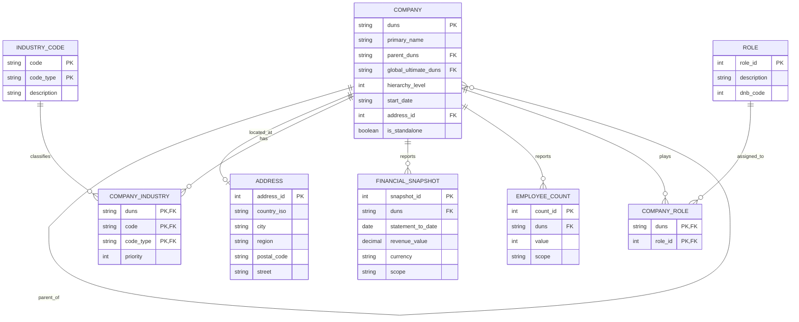
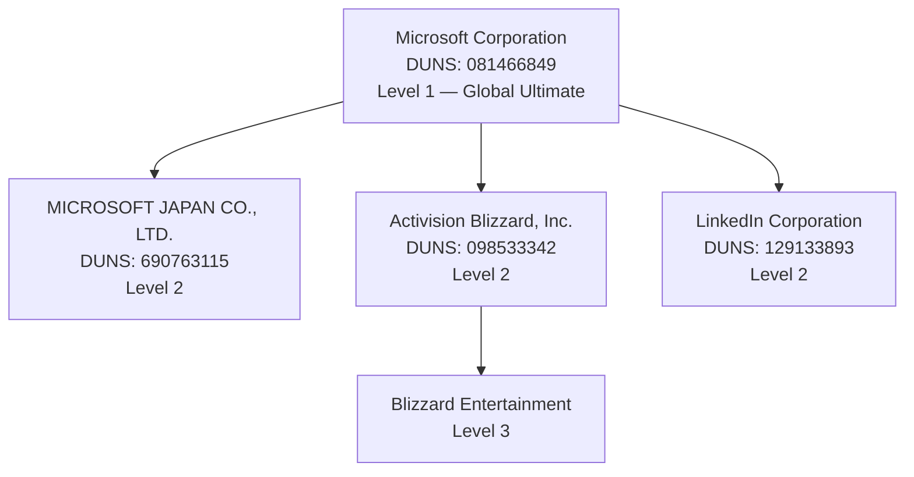

# Data Modelling

## Entity-Relationship Diagram



## Corporate hierarchy — Microsoft example



## Design decisions

### DUNS as primary key

DUNS (Data Universal Numbering System) is a 9-digit identifier assigned by D&B. It is globally unique, immutable, and present in both source files (`family_tree.json` and `data_blocks.json`). Using it as the PK avoids surrogate keys and makes joins with any other D&B dataset trivial — no lookup table needed.

### Self-referencing FK for hierarchy

`COMPANY.parent_duns` is a nullable FK pointing back to `COMPANY.duns`. This is the standard adjacency-list pattern for hierarchies. It handles any depth cleanly, and recursive CTEs traverse the full tree in one query:

```sql
WITH RECURSIVE tree AS (
  SELECT duns, primary_name, parent_duns, 1 AS depth
  FROM company
  WHERE parent_duns IS NULL          -- start at the root

  UNION ALL

  SELECT c.duns, c.primary_name, c.parent_duns, t.depth + 1
  FROM company c
  JOIN tree t ON c.parent_duns = t.duns
)
SELECT * FROM tree ORDER BY depth, duns;
```

The Microsoft family tree is 8 levels deep; Bain Capital is 11. The adjacency list handles both without schema changes.

### Composite PK on INDUSTRY_CODE

D&B provides industry codes from multiple classification systems: NAICS 2022, US SIC 1987, NACE Rev. 2, ISIC Rev. 4, D&B SIC, D&B Hoovers. A single company (Microsoft) has 22 codes across 7 systems. The same numeric code can mean completely different things in different systems, so the PK is `(code, code_type)`. Storing all codes in one table with a `type_description` column means adding a new classification system requires no schema change.

### `scope` column on financial and employee tables

D&B reports both *individual* (this legal entity only) and *consolidated* (the whole group) figures. Harford Bank shows this clearly: 35 employees at headquarters, 80 consolidated. Instead of two columns (`individual_employees`, `consolidated_employees`), a `scope` discriminator keeps the schema flexible if a third scope appears (e.g., regional).

### ROLE as a lookup table

The set of corporate roles is finite and controlled by D&B: Global Ultimate, Domestic Ultimate, Parent/Headquarters, Subsidiary, Branch/Division. Storing the description as a free-text column on `COMPANY` would duplicate strings and make filtering by role expensive. The `ROLE` lookup table stores each description once; `COMPANY_ROLE` is the junction.

A company can hold multiple roles simultaneously — Microsoft Japan is both a Subsidiary and a Domestic Ultimate and a Parent/HQ. The junction table handles this naturally; a single `role` column on `COMPANY` would not.

### `start_date` as string

The D&B source mixes date formats: `"1975"` (year only), `"1986-02"` (year + month), `"1983-04-01"` (full date). Coercing to `DATE` would either lose precision or reject valid records. Storing as `VARCHAR` preserves the original value; date logic can be applied at query time with `SUBSTR` or a CASE expression.

## SQL DDL

```sql
CREATE TABLE company (
  duns                VARCHAR(9)   PRIMARY KEY,
  primary_name        VARCHAR      NOT NULL,
  parent_duns         VARCHAR(9)   REFERENCES company(duns),
  global_ultimate_duns VARCHAR(9)  REFERENCES company(duns),
  hierarchy_level     INTEGER,
  start_date          VARCHAR(10),
  address_id          INTEGER      REFERENCES address(address_id),
  is_standalone       BOOLEAN
);

CREATE TABLE address (
  address_id   SERIAL       PRIMARY KEY,
  country_iso  CHAR(2),
  city         VARCHAR,
  region       VARCHAR,
  postal_code  VARCHAR,
  street       VARCHAR
);

CREATE TABLE industry_code (
  code         VARCHAR,
  code_type    VARCHAR,
  description  VARCHAR,
  PRIMARY KEY (code, code_type)
);

CREATE TABLE company_industry (
  duns       VARCHAR(9) REFERENCES company(duns),
  code       VARCHAR,
  code_type  VARCHAR,
  priority   INTEGER,
  PRIMARY KEY (duns, code, code_type),
  FOREIGN KEY (code, code_type) REFERENCES industry_code(code, code_type)
);

CREATE TABLE financial_snapshot (
  snapshot_id        SERIAL   PRIMARY KEY,
  duns               VARCHAR(9) REFERENCES company(duns),
  statement_to_date  DATE,
  revenue_value      NUMERIC,
  currency           CHAR(3),
  scope              VARCHAR   -- 'Individual', 'Consolidated'
);

CREATE TABLE employee_count (
  count_id  SERIAL   PRIMARY KEY,
  duns      VARCHAR(9) REFERENCES company(duns),
  value     INTEGER,
  scope     VARCHAR   -- 'Individual', 'Consolidated'
);

CREATE TABLE role (
  role_id     SERIAL   PRIMARY KEY,
  description VARCHAR,
  dnb_code    INTEGER
);

CREATE TABLE company_role (
  duns     VARCHAR(9) REFERENCES company(duns),
  role_id  INTEGER    REFERENCES role(role_id),
  PRIMARY KEY (duns, role_id)
);
```
